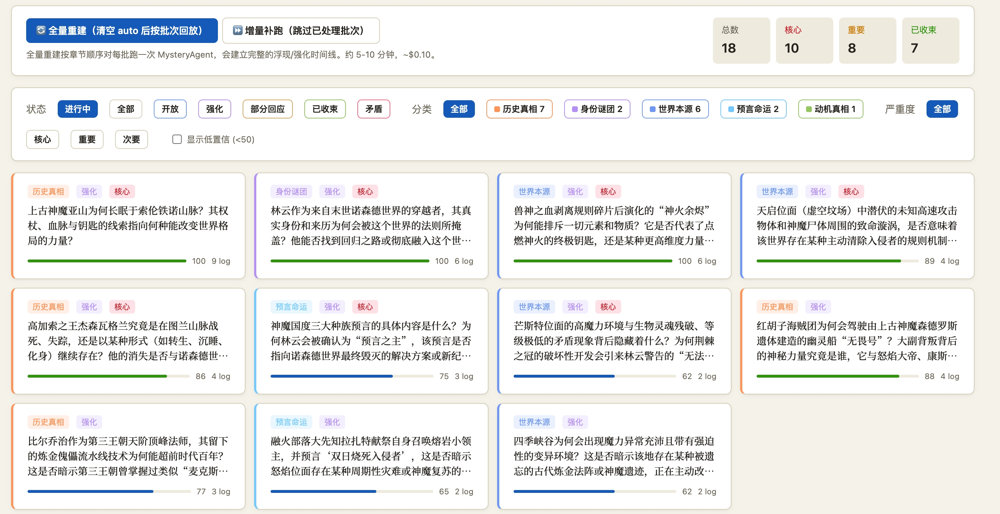
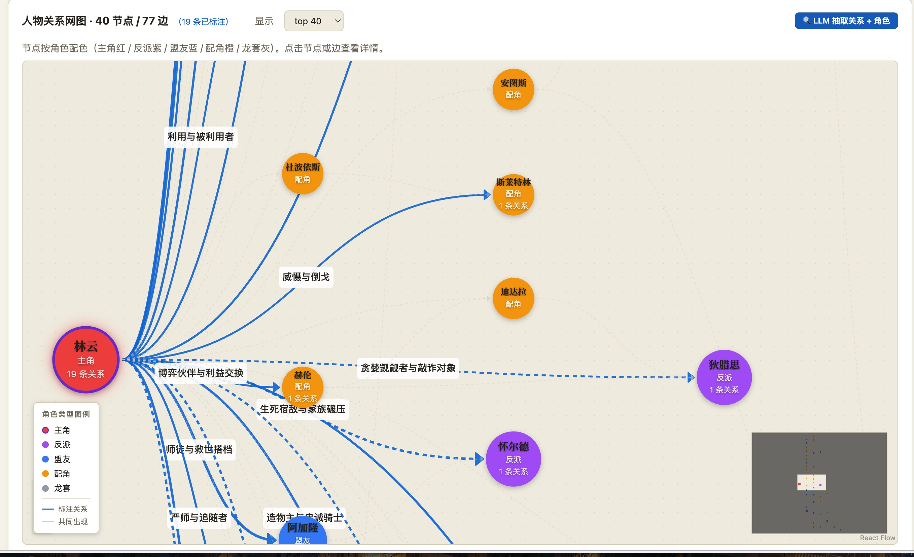
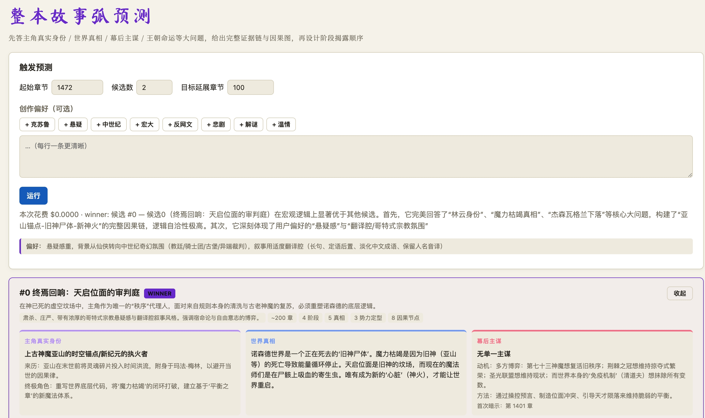
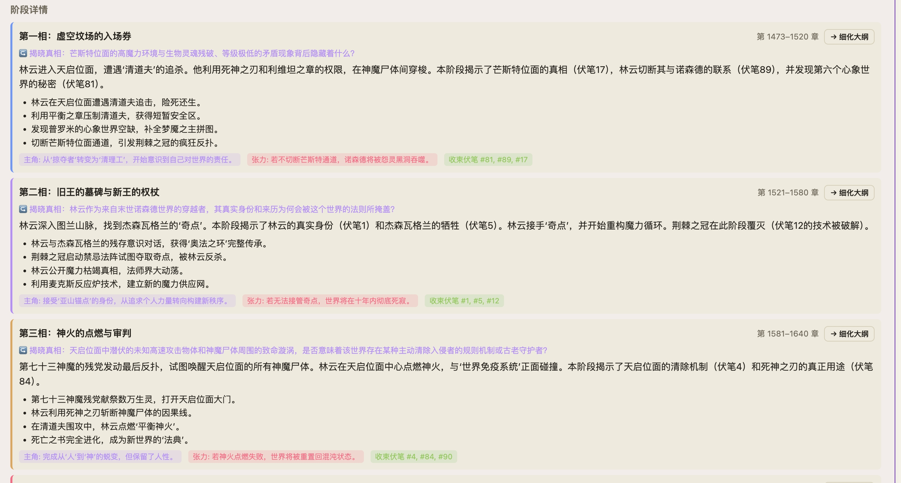
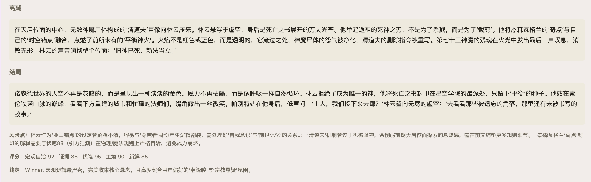

<div align="center">


# 墨笔 · MoBi

**面向百万字长篇网文的多 Agent 续写工作流**

先把已写章节嚼成结构化记忆，再让 21 个 LLM agent 按记忆推演剧情、模拟角色、写出新章。

[](https://www.python.org/)
[](https://fastapi.tiangolo.com/)
[](https://nextjs.org/)
[](https://www.typescriptlang.org/)
[](https://ant.design/)
[](https://reactflow.dev/)
[](https://help.aliyun.com/zh/dashscope/)
[](https://www.sqlite.org/fts5.html)
[](https://www.trychroma.com/)
[](LICENSE)

[](https://mobi-ai-novel.netlify.app/)

[**📖 在线 Demo**](https://mobi-ai-novel.netlify.app/) ·
[**架构文档**](墨笔-agent架构设计docs/00-总览.md) ·
[快速开始](#-快速开始) ·
[特性](#-核心特性) ·
[Agent 速查](#-21-个-agent) ·
[技术栈](#-技术栈)

</div>

---

> ### 🧬 本仓库是「孪生双项目」的公用仓库
>
> | 项目 | 目录 | 端口 | 定位 |
> |---|---|---|---|
> | **墨笔 · MoBi**（本 README 主体) | `backend/` + `frontend/` | 后端 8000 / 前端 3100 | **多 Agent 续写**:把长篇嚼成结构化记忆 → 推演 → 写整本 |
> | **墨析 · MoXi** | [`novel-analysis-imitate/`](novel-analysis-imitate/) | 后端 8100 / 前端 3200 | **跨书深度分析 + 仿写/重组**:拆解技法/文笔/架构 → 文风基因组 → 驱动生成 |
>
> 墨析把整个 `backend/` 当**可 import 的包**复用(零改墨笔),共享同一套 `data/books/<书>/novel.db` 与 settings;详见下文 [**🧬 孪生项目 · 墨析**](#-孪生项目--墨析--novel-analysis-imitate) 与 [`novel-analysis-imitate/README.md`](novel-analysis-imitate/README.md)、[`文风基因组-设计.md`](novel-analysis-imitate/文风基因组-设计.md)。

---

## 📖 在线 Demo · 墨笔书阁

**<https://mobi-ai-novel.netlify.app/>** —— 用墨笔把江南《天之炽》从第 157 章一路续写到结局（至第 260 章，约 58.5 万字）的成品阅读站：书架首页 → 书籍简介与大纲（清晰区分原著 1–156 章与 AI 续写 157–260 章）→ 左目录右正文的纯中文阅读体验。

> 续写部分由「写 → 真三审(剧情/一致性/文风) → 回灌记忆」滚动地平线流程生成，仿写原作者文风、对齐原著单章体量，逐章进 git 可追溯。站点源码与数据见 [`结果/`](结果/)。

---

## 哲学

> **记忆 > 上下文** · **多 Agent > 单 Agent** · **时序约束 > 自由生成** · **流程可溯 > 黑箱**

让 LLM 直接续写一本读了 100 万字的小说会塌——它会忘伏笔、写偏人物、违反世界设定。**墨笔** 的思路不是把更聪明的模型扔进去，而是先把"读者大脑"建模出来：用专门的 agent 把小说拆成可查询的结构化记忆，每次续写时只取**当下应该被想起的部分**注入上下文。

---

## ✨ 核心特性

### 📚 多书管理 · 数据完全隔离
- 把 `.txt` 拖进 `data/library/`，前端一键导入；编码自动检测（UTF-8 / GBK / Big5）
- 每本书独立 SQLite + ChromaDB + 语料；切书互不影响
- 多卷本支持（龙族这种"第一章"重复的也能正确切分）

### 🧠 四层外部记忆栈
- **L1 SQLite** — 11 张结构化表，每条事实带 `chapter` 时序戳
- **L2 FTS5 trigram** — 中文全文检索（比通用 embedding 更尊重作者用词）
- **L3 ChromaDB** — 章节级向量，懒加载兜底
- **L4 Graph Projection** — 把 SQLite 行投影成 React Flow 节点+边

### 🔍 6-Agent 增量抽取链
```
Entity → Foreshadow → State → Plot → World → Mystery
```
6 个 agent 顺序跑，每批共享 cached prefix 节省 50-80% 输入 token。
1472 章全本抽取 ≈ **$5-8 / 40-60 分钟**。

### 🎯 三段式预测（发散→收敛→执行）
- **Stage A**（T=0.95）发散 N 条迥异候选，强制引用真实伏笔 ID
- **Stage B**（T=0.2）多维打分选 winner
- **Stage C**（T=0.75）流式落正文，FTS 召回原文笔法范本
- **全弧版** 一次产出 100-200 章宏观弧 + 4 阶段揭露路径 + 因果图

### ✍️ ReAct 写作流（Writer + 3 Reviewer + Editor）
```
Writer → [文风/剧情/一致性] 三审并行 → Editor 仲裁 → ≤3 轮重写
```
**实时阶段进度**：前端轮询展示「Writer 写稿 ··· → 三审并行 (2/3) → Editor 仲裁 → 完成本轮」

### 🎭 角色仿真（5-8 角色 × 3-5 轮）
> 灵感来源 `MiroFish` 的多 agent 实验。每个角色独立调 LLM、只看自己应该知道的事，多轮迭代后由 ReportAgent 综合成章。
- **CharacterProfile** — bio / desires / fears / voice_style / secrets_known / secrets_hidden
- **Interview** — 第一人称流式问答，滑块控制"截至第 N 章" — 早期/晚期 TA 回答会显著不同
- **Multi-Round Simulator** — 平均 ~$0.08 / 章 / 3-4 分钟

### ❓ 跨批 Mystery Agent
不是单纯抽实体，而是**累积维护读者还在追问的悬念**：`add` / `sharpen` / `resolve` 三种动作跨批迭代，confidence 随线索增加上升。

### 🔁 完整链路跨页跳转
```
arc 全弧 ▸ 候选 N ▸ 第N相 ▸ 大纲 #M ▸ 第 1473 章
```
- `/arc` 已细化的 phase 自动显示绿色「✓ 已细化 → 大纲 #N」
- `/outline` 章节卡片显示「✓ 已写 #N 」/「续写 →」状态
- `/draft` 顶部面包屑可点击回溯整个生成链
- URL 深链：`?id=N&candidate=0` 刷新/分享不丢上下文

### 🛠️ 可视化模型/参数面板
- 切换 Qwen 全系（3.5-flash / 3.6-plus / 3.6-max-preview / qwen-max）+ DeepSeek
- 21 个 agent 各自温度 / max_tokens / top_p 单独覆盖
- API Key 管理（设置 → env 优先级，遮罩展示，一键测试连接）

### 📊 完整审计层
所有 LLM 调用入 `llm_calls` 表（agent / model / tokens / latency / $）。`/monitor` 看 168 小时聚合。

---

## 🆕 最新架构升级（把"续一章"做成"写完整本书"）

在线 Demo 的《天之炽》157→260 全本就是这套链路跑出来的。详见 [`07-整本故事弧推演链路`](墨笔-agent架构设计docs/07-整本故事弧推演链路.md) 与 [`08-版本控制与可重建记忆`](墨笔-agent架构设计docs/08-版本控制与可重建记忆.md)。

### 🌌 整本故事弧推演 + 滚动地平线写整本
arc 顶层骨架定全局 → 逐阶段展开成连续全书大纲（章号重锚定 + 完整性裁决）→ **写整本书**编排器：逐章「写 → 真三审 → 回灌记忆 → 下一章读得到」滚动推进，阶段级跨章复审 + 人审 gate，检查点续跑。一次把《天之炽》补全 104 章（~58.5 万字）到结局。

### 🔁 写→回灌记忆反馈环（章节互锁）
每写完一章即用同一套 6-agent 抽取其实体/伏笔/状态/世界规则，增量写回记忆，使后续章节"读得到"刚写的章——避免越写越失忆。

### 🗂️ 版本控制层：Git 管「源」· SQLite 当可重建缓存
每本书一个独立 git 仓（manuscript 正文 / baseline 原著记忆 / increments 每章抽取增量 / suggestions 润色建议）。记忆 = 基线 ⊕ 按章重放增量，`materialize()` 可由 git 内容**确定性重建** DB（往返自测一致）。支持**按章撤回**、**分支并行探索剧情**、删库重物化，每章定稿自动 commit。

### ✍️ 文风对齐三件套（仿写不再"翻译腔/网文腔"）
书本级**动态字数**（从原著章节中位数自动定，按书而异，非写死）+ **场景类型范文 few-shot**（打斗/对话/景物各取原著真实段落让写手照着写）+ **避用词硬约束**（套路反应词黑名单）。

### 🏛️ 第 4 审「时代语域」（默认关 · 每本书可配）
抽一张「世界观语域卡」（技术/年代基准 + 各阵营文化语域），按词的**归属角色**判时代错置与文化语域错置（太监属东方阵营在西方场景也对，西方角色说东亚黑话才算错）；东西方同台逐元素各判各的。

### 🌐 双语交织 + 局部润色采纳（git-merge 式）
中文真过审后**锚定生成**英文版（非直译、保留原作者笔法）。润色建议落库 + 进 git + **锚点失效检测**：原文改过则该条标失效、禁止应用，像 IDE diff 一样**逐条采纳**。

### 📖 静态阅读站（[`结果/`](结果/) · 已部署 Netlify）
零构建纯静态：书架 → 简介/大纲（区分原著与续写）→ 左目录右正文。数据生成器从 corpus + DB 导出 → [在线 Demo](https://mobi-ai-novel.netlify.app/)。

---

## 🚀 快速开始

### 前置依赖

| | 版本 |
|---|---|
| Python | 3.13+ |
| Node | 18+ |
| LLM API | DashScope 阿里云百炼 / OpenAI 兼容端点 |

### 1️⃣ 后端

```bash
cd backend
python3.13 -m venv .venv
.venv/bin/pip install -e .

# 把 API key 写入 .env
echo "DASHSCOPE_API_KEY=sk-xxx" > .env

# 起服务（首次访问 /books 会自动初始化目录结构）
.venv/bin/uvicorn app.main:app --reload --port 8000
```

### 2️⃣ 前端

```bash
cd frontend
npm install
npm run dev   # http://localhost:3100
```

### 3️⃣ 导入第一本书

```bash
# 把小说 .txt 放进库文件夹
cp ~/Downloads/我的小说.txt backend/data/library/
```

浏览器打开 [http://localhost:3100/library](http://localhost:3100/library) → 点 **导入并切换** → 跳转到 `/ingest` → 点 **切分当前书** → 再点 **⚡ 一键抽取全书**。

剩下的工作流：

| 路径 | 用途 |
|---|---|
| `/library` | 多书切换 / 导入新书 |
| `/ingest` | 切分章节 + 多 agent 抽取（带阶段进度条） |
| `/graph` | 人物关系图 + 伏笔甘特 + 主角演变 + 剧情时间线 |
| `/items` | 宝物功法谱（主角沿途获得 / 失去） |
| `/mysteries` | 读者还在追问的悬念 |
| `/predict` | 单章续写（发散 → 收敛 → 流式精写） |
| `/arc` | 全弧 100-200 章预测 |
| `/sim` | 多角色仿真 |
| `/character/[id]` | 角色档案 + 第一人称 interview |
| `/outline` | phase → 逐章大纲细化 + 续写状态 |
| `/draft` | Writer + 三审 + Editor 出稿（实时进度条） |
| `/monitor` | LLM 调用审计 / cost 看板 |
| `/architecture` | 系统架构文档浏览器 |
| `/settings` | 模型 / 参数 / API Key 管理 |

---

## 🤖 21 个 Agent

| 链路 | Agent | model | T | 输出 |
|---|---|---|---|---|
| 抽取 | `extract.entity` | FAST | 0.3 | tool_use |
| 抽取 | `extract.foreshadow` | FAST | 0.3 | tool_use |
| 抽取 | `extract.state` | FAST | 0.3 | tool_use |
| 抽取 | `extract.plot` | FAST | 0.3 | tool_use |
| 抽取 | `extract.world` | FAST | 0.3 | tool_use |
| 抽取 | `extract.mystery` | FAST | 0.3 | tool_use |
| 图谱 | `relationships.extract` | FAST | 0.3 | tool_use |
| 预测 | `predict.diverge` | STRONG | 0.95 | tool_use |
| 预测 | `predict.score` | STRONG | 0.2 | tool_use |
| 预测 | `predict.write` | STRONG | 0.75 | stream |
| 全弧 | `arc.diverge` | STRONG | 0.9 | tool_use |
| 全弧 | `arc.score` | STRONG | 0.2 | tool_use |
| 写作 | `outline.refine` | STRONG | 0.6 | tool_use |
| 写作 | `draft.writer` | STRONG | 0.75 | text |
| 写作 | `draft.review.style` | FAST | 0.2 | tool_use |
| 写作 | `draft.review.plot` | FAST | 0.2 | tool_use |
| 写作 | `draft.review.consistency` | FAST | 0.2 | tool_use |
| 写作 | `draft.editor` | FAST | 0.2 | tool_use |
| 仿真 | `profile.build` | FAST | 0.3 | tool_use |
| 仿真 | `interview` | FAST | 0.7 | stream |
| 仿真 | `sim.decide` | FAST | 0.85 | tool_use |
| 仿真 | `sim.report` | STRONG | 0.7 | text |

每个 agent 都可以在 `/settings` 页单独覆盖 model / T / max_tokens / top_p。

---

## 🏗️ 系统架构

```
┌────────────── 语料层 ──────────────┐
│  小说原文 (.txt)                   │
│  └─ 编码检测 → 分章 → Chapter 表    │
└────────────────────────────────────┘
                 │
                 ▼
┌──────────── 抽取链路 (一次性) ─────────────┐
│  6 个 agent 串行 × 4 章/批 (密度更优)      │
│  Entity → Foreshadow → State              │
│  → Plot → World → Mystery                 │
└────────────────────────────────────────────┘
                 │
                 ▼
┌──────────── 记忆层 (持久, 按章节时序) ─────┐
│  SQLite (FTS5 trigram) + ChromaDB(lazy)   │
│  + Graph Projection                       │
│  ▲ 由 Git「源」确定性物化(可重建/可回退)  │
└────────────────────────────────────────────┘
                 │
       ┌─────────┼─────────┬──────────┐
       ▼         ▼         ▼          ▼
   ┌─预测─┐  ┌─写作─┐  ┌─仿真─┐  ┌─疑点─┐
   │三段式│  │ 4 审 │  │5 角色│  │ 跨批 │
   │ A→B→C│  │ ReAct│  │×3 轮 │  │ 增量 │
   └──────┘  └───┬──┘  └──────┘  └──────┘
                 ▼
   ┌──────── 整本重写 (滚动地平线) ────────┐
   │ arc 骨架→全书大纲→逐章(写→真三审→回灌)│
   │ →阶段复审/人审 gate · 每章自动进 git    │
   └────────────────────────────────────────┘
```

详细设计见 **[架构文档](墨笔-agent架构设计docs/)**：

- [00 · 总览](墨笔-agent架构设计docs/00-总览.md)
- [01 · 上下文记忆模块](墨笔-agent架构设计docs/01-上下文记忆模块.md)
- [02 · 语料抽取链路](墨笔-agent架构设计docs/02-语料抽取链路.md)
- [03 · 预测链路](墨笔-agent架构设计docs/03-预测链路.md)
- [04 · 写作链路](墨笔-agent架构设计docs/04-写作链路.md)（含真三审修复 · 动态字数 · 场景范文 · 双语 · 第4审时代语域 · 润色采纳）
- [05 · 角色仿真链路](墨笔-agent架构设计docs/05-角色仿真链路.md)
- [06 · Agent 与 Prompt 设计](墨笔-agent架构设计docs/06-Agent与Prompt设计.md)
- [07 · 整本故事弧推演链路](墨笔-agent架构设计docs/07-整本故事弧推演链路.md) 🆕
- [08 · 版本控制与可重建记忆](墨笔-agent架构设计docs/08-版本控制与可重建记忆.md) 🆕

---

## 💸 成本参考

| 操作 | 模型 | 一次成本 | 时长 |
|---|---|---|---|
| 全本抽取（1472 章） | qwen3.5-flash | $5-8 | 40-60 分 |
| 单章续写（A→B→C） | qwen3.5-flash | $0.01-0.03 | 60-120 秒 |
| 全弧 200 章预测 | qwen3.6-plus | ~$0.007 | 3-4 分 |
| 单章 Writer + 三审 + Editor | qwen3.5-flash | $0.012-0.025 | 50-90 秒 |
| 5 角色 × 3 轮仿真 | qwen3.5-flash | ~$0.08 | 3-4 分 |
| 角色档案构建（top-20） | qwen3.5-flash | ~$0.05 | 2 分 |
| 单次 interview | qwen3.5-flash | ~$0.005 | 30 秒 |

可在 `/settings` 把 STRONG lane 升档到 `qwen-max` / `qwen3.6-max-preview`，质量更高但贵 5-20 倍。

---

## 🛠️ 技术栈

### 后端
- **Python 3.13** + **FastAPI** + **Pydantic** + **SQLAlchemy 2**
- **SQLite + FTS5 trigram** + **ChromaDB**（懒加载）
- **OpenAI Python SDK** (兼容端点) → DashScope Qwen
- **ThreadPoolExecutor** 跨 agent 并行
- **SSE** 流式输出

### 前端
- **Next.js 14** App Router + **TypeScript**
- **Ant Design 6** + **React Flow 12** + **dagre** 自动布局
- **react-markdown + remark-gfm** 文档渲染
- **Ma Shan Zheng** 装饰字体 + 衬线正文
- 双主题（modern Sider / classic top-nav）+ 双色彩（dark/light）

### LLM
- **Qwen 3.5-flash** （默认 FAST + STRONG，性价比最高）
- **Qwen 3.6-plus / 3.6-max-preview** （深度思考 / Coding+，可在 /settings 切换）
- **Qwen-max / qwen-plus** （稳定旗舰 / 性价比）
- **DeepSeek-V4-flash / pro** （可选外部，OpenAI 兼容协议接入）

---

## 🧬 孪生项目 · 墨析 · novel-analysis-imitate

墨笔解决「**续写**一本书」;**墨析**解决「**拆解一批书、再借它们的笔法写新的**」。它把墨笔的整套 `backend`(LLM 客户端 / 6 抽取 agent / 关系图 / 风格 / 笔法 / 生成内核)当**包 import**,只**新增**「时间轴 / 技法 / 文风基因组」分析层与跨书编排,**零改墨笔**;共享同一份 per-book `novel.db` 与 `settings.json`。

> 形态:独立 **FastAPI :8100 + Next.js :3200**;视觉为**稿纸 · 朱批 · 水墨**(区别于墨笔)。当前全链路模型切到**小米 MiMo**(火山额度告急时切换),FAST/STRONG lane 复用墨笔 settings。

### 🔬 深度分析(9 个维度,前端左栏切换 · 图表/文字双视图)
- **基础抽取**(复用墨笔 6 agent + 关系图):实体 / 伏笔 / 剧情点 / 世界规则 / 关系网
- **速读 · 剧情脉络** — 按章序切阶段,重要阶段详写(发生/铺垫/内心/转折/线索),次要一句带过
- **节拍 · 张力曲线** — 逐章 张力/场景类型/plot_function/章末钩子(ECharts 曲线)
- **文笔 · 声音** — StyleProfile:整体声音/句式/语域/常用词汇/套路/范文 + 26 类笔法卡
- **世界观铺垫** — 设定揭示事件:手法/信息倾倒率/埋设跨度(江南式反信息倾倒量化)
- **人物关系** — 关系演变事件 + **react-flow 关系网络图** + 主要人物简介卡(据关系/POV/出场或实体表自动判重要度)
- **视角调度** — POV 切换时间轴(离主视角时长/切回触发)
- **金手指** — 升级台阶/触发方式/对手差距 → 升级斜率
- **设定 · 伏笔** — 世界设定词条 / 伏笔(埋设→回收/状态) / 剧情点逐条

### 🧬 文风基因组(STYLE GENOME · 7 层)
把「文风」从一段总结升级成**可复用、可喂给别的 LLM 复现**的分层范式:`L1 词汇分层 / L2 句式构式 / L3 修辞与叙述声音 / L4 类型氛围配方 / L5 场景调度套路 / L6 宏观架构 / L7 转移模型(场景马尔可夫,Transformer/LSTM 类比)`。
- 每层走「**分场景桶取样 → LLM 抽范式 → 纯代码量化兜底**(密度 str.count/千字、弱断言频率、张力峰检测、转移矩阵)」
- 组装出 **fingerprint_vector**(可计算文风向量)+ **system-prompt spec**(一键复制喂给任意 LLM)
- 双档复用:静态 spec(`compose.seed_genome` 拼进 writer) / 动态逐章 brief(L7 当采样器)
- **对照评测**:同章大纲 基线(单段总结) vs 基因组(分层 spec)各生成 → 7 维盲评 + 指纹对账 → **基因组全面胜出(整体 65.25 vs 56.75,场景调度 +10.75)**
- 专页 `/genome`:保姆级讲解 + **KaTeX 公式渲染** + L1 密度热力条 + L7 转移图 + 真实抽取样例
- **解析视频** [`novel-analysis-imitate/docs/genome.mp4`](novel-analysis-imitate/docs/genome.mp4):七层结构与核心公式逐层讲透 —— L1 密度 ρ、L2 弱断言红线、L6 张力峰判据、L7 马尔可夫转移、保真度的余弦 / KL / 相对误差,**MathML 原生公式 + 小米 MiMo TTS 旁白**(约 5min · 1080p),合成同 [`video-pipeline/`](video-pipeline/)
- 设计与评测全文见 [`novel-analysis-imitate/文风基因组-设计.md`](novel-analysis-imitate/文风基因组-设计.md)

### ✍️ 四类生成用例(compose 虚拟书 · 复用墨笔生成内核)
统一收敛到「**compose 虚拟书 → set_active → OutlineRun → draft.write_chapter(三审一编辑)**」,差别只在塞什么:
- **UC2 文风迁移** — 用 A 的文风(或基因组 spec)写你的故事;`voice_only` 模式只搬声音/笔法、不串 A 的剧情
- **UC1 融合世界观+文风** — 多书 `fused_worldview / fused_style / fused_technique` 融合 → 写自创剧情
- **UC4 技法注入** — `technique_template` 逐章约束节奏/POV/铺垫(可自动从分析层蒸馏)
- **UC3 剧情移植** — 抽 A/B/C 去设定剧情母核 → 重锚定到目标世界观 → 用其文风写

### 🧱 工程基座
- **book_scope 进程级绑定**(contextvar):多进程并发分析/生成时锁定当前书,无视共享 active 指针 → **不写串库**
- 结构化输出 JSON-in-text + json_repair;小米仅 json_object,传 json_schema 自动降级
- **架构动画**:[`novel-analysis-imitate/docs/architecture-animation.html`](novel-analysis-imitate/docs/architecture-animation.html) —— GSAP scrollytelling 自包含单文件,7 幕讲解整条管线(浏览器直接打开)
- **架构解析视频**:[`novel-analysis-imitate/docs/architecture.mp4`](novel-analysis-imitate/docs/architecture.mp4) —— 同 7 幕 + **小米 MiMo TTS(白桦音色)中文旁白解说**(148s · 1080p · 节奏由旁白时长驱动)。合成管线见仓库根 [`video-pipeline/`](video-pipeline/):旁白合成 → 烘焙时间轴 → headless Chrome 逐帧 → ffmpeg 混流

> **致谢 · 视频合成依赖**:逐帧渲染范式借鉴 [nexu-io/html-video](https://github.com/nexu-io/html-video)(Hyperframes:单文件动画 HTML → 无头浏览器逐帧捕获 → ffmpeg 编码);滚动/时间轴动画遵循 [greensock/gsap-skills](https://github.com/greensock/gsap-skills) 的 GSAP + ScrollTrigger 最佳实践。

### 🚀 启动墨析
```bash
# 后端(复用墨笔 .venv;venv 的 uvicorn shebang 已坏,必须 python -m)
cd novel-analysis-imitate/backend
PYTHONPATH=. ../../backend/.venv/bin/python -m uvicorn naimitate.main:app --host 0.0.0.0 --port 8100
# 前端
cd novel-analysis-imitate/frontend && npm install && npm run dev   # http://localhost:3200(/api/* 自动代理到 :8100)
```

---

## 📁 项目结构

```
.
├── backend/
│   └── app/
│       ├── main.py                      # FastAPI 入口
│       ├── config.py                    # 全局配置
│       ├── db.py                        # 按 active book 的 lazy engine
│       ├── books/                       # 多书管理（library/library.py + api.py）
│       ├── settings/                    # 运行时模型/参数/API key 覆盖
│       ├── ingest/                      # 切分 + 多 agent 抽取
│       ├── memory/                      # SQLAlchemy 模型 + FTS + 向量
│       ├── llm/
│       │   ├── client.py                # OpenAI 兼容客户端 + 审计
│       │   └── prompts/                 # 12 个 prompt 文件
│       ├── predict/                     # 单章 + 全弧三段式预测
│       ├── outline/                     # phase → 逐章大纲
│       ├── draft/                       # Writer + 三审 + Editor + ReAct
│       ├── sim/                         # 角色档案 + interview + 多轮仿真
│       ├── mysteries/                   # 跨批 mystery 增量
│       ├── graph/                       # 图谱投影
│       └── monitor/                     # 调用审计聚合
├── frontend/
│   ├── public/logo.png                  # 墨字 logo
│   └── app/
│       ├── library/                     # 书架
│       ├── ingest/                      # 切分 + 抽取（带进度条）
│       ├── graph/                       # 人物 / 伏笔 / 主角 / 时间线
│       ├── items/ mysteries/            # 物品 / 疑点
│       ├── predict/ arc/                # 单章 / 全弧预测
│       ├── outline/ draft/              # 大纲 / 成稿（带阶段进度）
│       ├── sim/ character/[id]/         # 仿真 / 角色对话
│       ├── monitor/                     # cost 看板
│       ├── architecture/                # 内嵌架构文档浏览器
│       └── settings/                    # 模型 / 参数 / API key
├── 墨笔-agent架构设计docs/              # 7 篇设计文档（在前端 /architecture 渲染）
├── novel-analysis-imitate/              # 🧬 孪生项目「墨析」(跨书分析 + 仿写/重组)
│   ├── backend/naimitate/
│   │   ├── main.py                      # FastAPI :8100(import 墨笔 app 为包)
│   │   ├── bootstrap.py                 # 把 ../../backend 加进 sys.path
│   │   ├── analysis/                    # 分析层:base/speedread/beat/style/worldview/
│   │   │   │                            #   relationship/pov/golden/character +
│   │   │   ├── style_genome.py          #   文风基因组 7 层
│   │   │   ├── _fingerprint.py          #   指纹确定性工具(密度/转移/KL·余弦保真度)
│   │   │   ├── _sampling.py             #   分场景取样器
│   │   │   └── genome_eval.py           #   基线 vs 基因组 对比评测
│   │   ├── generate/                    # 生成:compose/usecases(UC1-4)/fusion/technique/transplant
│   │   └── project/                     # project.db + 跨书编排 + compose_book/fused_product
│   ├── frontend/                        # Next.js :3200(深度分析/仿写重组/架构 + 文风基因组专页)
│   ├── docs/architecture-animation.html # GSAP scrollytelling 架构动画(自包含)
│   ├── docs/architecture-video.html     # 架构 · 时间驱动版动画(供逐帧渲染成视频)
│   ├── docs/architecture.mp4            # 架构解析视频(含 MiMo TTS 旁白解说)
│   ├── docs/genome-video.html           # 文风基因组 · 时间驱动版动画(MathML 公式)
│   ├── docs/genome.mp4                  # 文风基因组解析视频(7层结构+公式+TTS旁白)
│   ├── 分析和设计.md                     # 总体设计 + 实现状态
│   └── 文风基因组-设计.md                # 基因组规格 + 7维盲评结果
├── video-pipeline/                      # 🎬 解析视频合成管线(架构 / 文风基因组 · specs.json 驱动)
│   ├── specs.json                       #   每支视频:旁白文本 + html/out 路径 + 节奏常数
│   ├── narrate.py  bake_timeline.py     #   旁白合成(MiMo TTS) → 烘焙时间轴
│   ├── render.mjs  mux.py  build.sh     #   逐帧渲染(headless Chrome) → 合成音轨+混流 → 一键
│   └── README.md                        #   含 MiMo TTS 接口踩坑备忘
├── MiroFish/                            # 角色仿真灵感来源（git submodule 风格）
├── 末法王座.txt                          # 示例语料（1472 章）
└── 需求.md                              # 原始需求
```

---


## 界面示例截图

对小说已有部分的结构化信息提取：





未来剧情大纲预测：








## 📜 License

MIT

---

<div align="center">

<sub>墨笔 · 用 21 个 agent 接住一本百万字的小说　|　墨析 · 把一批书的文风拆成可复现的基因组。</sub>

</div>
